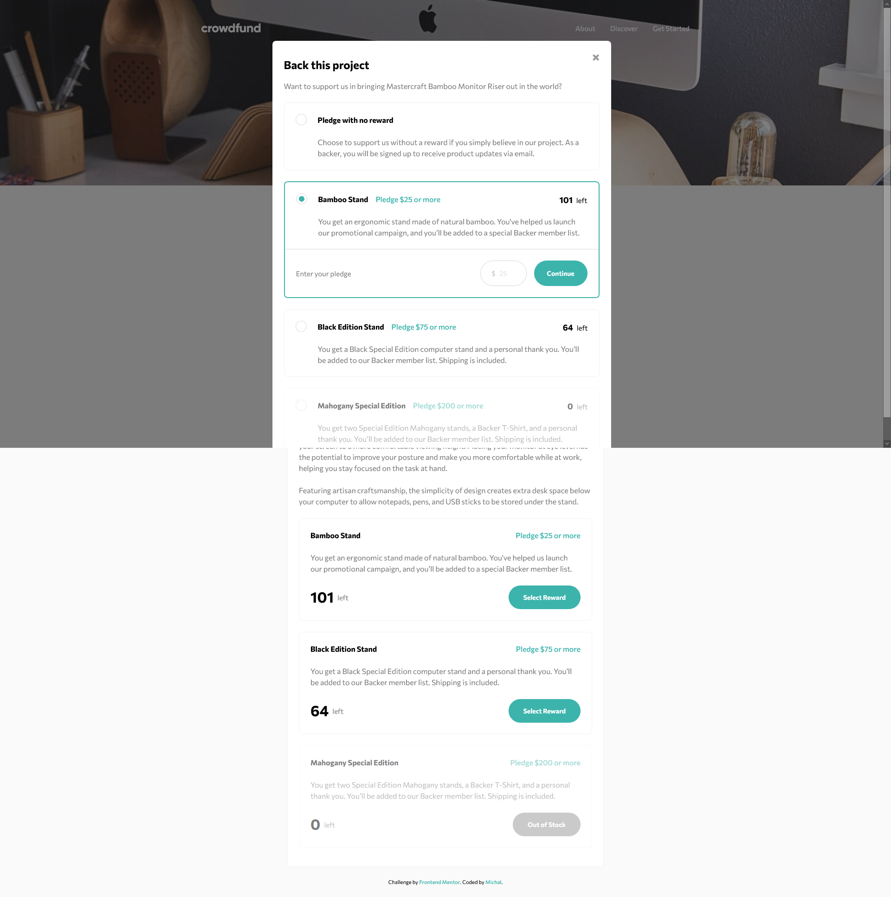

# Frontend Mentor - Crowdfunding product page solution

This is a solution to the [Crowdfunding product page challenge on Frontend Mentor](https://www.frontendmentor.io/challenges/crowdfunding-product-page-7uvcZe7ZR). Frontend Mentor challenges help you improve your coding skills by building realistic projects.

## Table of contents

- [Overview](#overview)
  - [The challenge](#the-challenge)
  - [Screenshot](#screenshot)
  - [Links](#links)
  - [Setup]
- [My process](#my-process)
  - [Built with](#built-with)
  - [What I learned](#what-i-learned)
  - [Continued development](#continued-development)
  - [Useful resources](#useful-resources)
- [Author](#author)

## Overview

### The challenge

Users should be able to:

- View the optimal layout depending on their device's screen size
- See hover states for interactive elements
- Make a selection of which pledge to make
- See an updated progress bar and total money raised based on their pledge total after confirming a pledge
- See the number of total backers increment by one after confirming a pledge
- Toggle whether or not the product is bookmarked

### Screenshot



### Links

[Live Site URL](https://crowdfunding-product-page-mbart13.vercel.app)

### Setup

To run this project, install it locally using npm:

```
npm install && npm start
```

To run Storybook:

```
npm run storybook
```

## My process

### Built with

- React
- Styled Components
- CountUp.js

### What I learned

I learned how to build modals from scratch without any libraries. Modal is accessible, user can navigate around the page and make a pledge using only keyboard.

For the first time I used atomic design methodology to structure the project and I will utilize it in my next bigger challenge to practice it more.

I used some simple animations to display the statistics in more interesting way.

Finally, I played a bit with Storybook in this project to document components in isolation and must say this is very useful tool and would like to use its full potential in a bigger project.

### Continued development

Learn more about accessible modals for screen readers.
Learn Jest to create unit tests.

### Useful resources

- [Animating React components](https://czaplinski.io/blog/super-easy-animation-with-react-hooks) - This article helped me to animate mounting and unmounting of modals.

- [Atomic Design Methodology](https://atomicdesign.bradfrost.com/chapter-2/) - Main ideas of this methodology

## Author

- Frontend Mentor - [@mbart13](https://www.frontendmentor.io/profile/mbart13)
  g
